# LR6
Лабораторная работа №6

***Порядок выполнения работы***
1. Создать аккаунт на сайте GitHub.

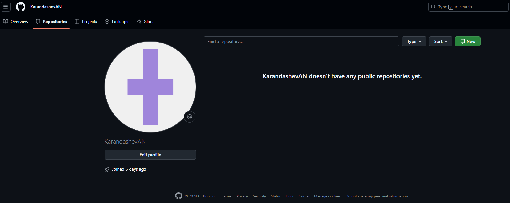

2. Сделать копию в личное хранилище из 
https://github.com/Kurtyanik/LR6/ (Fork).

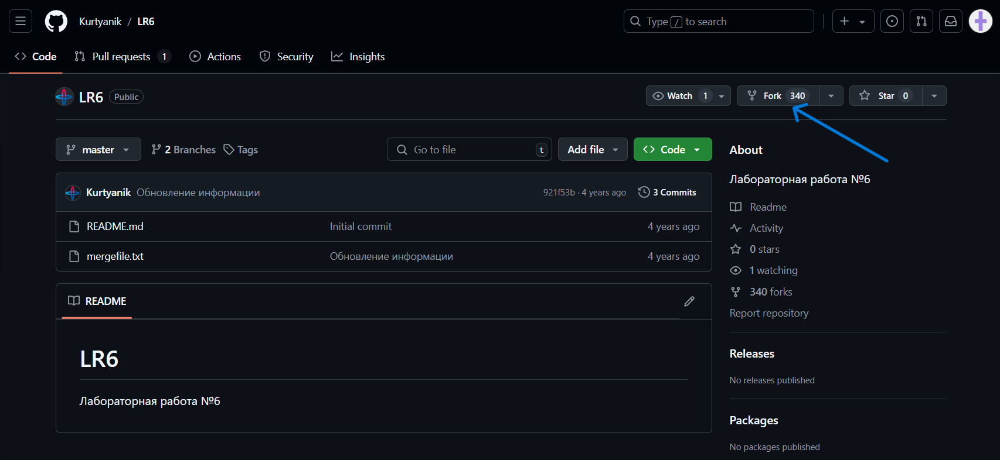

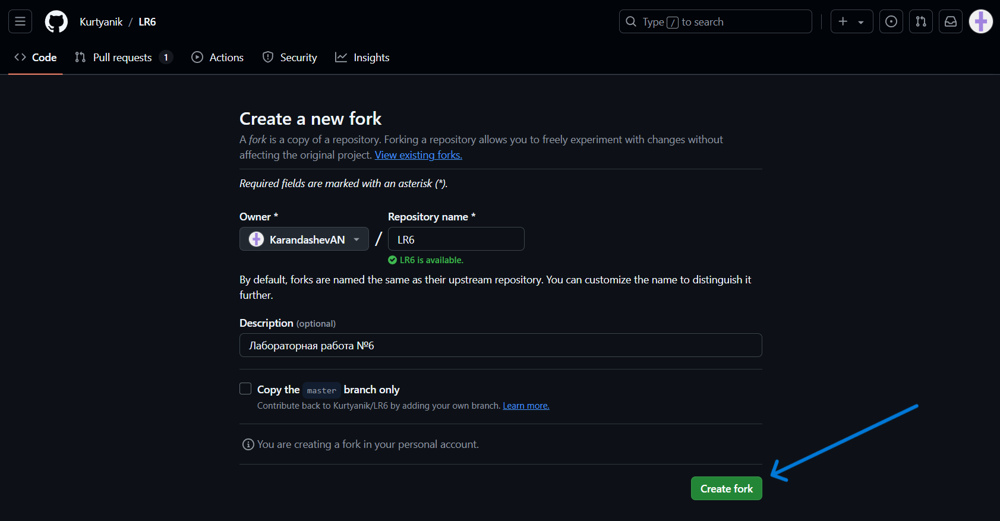

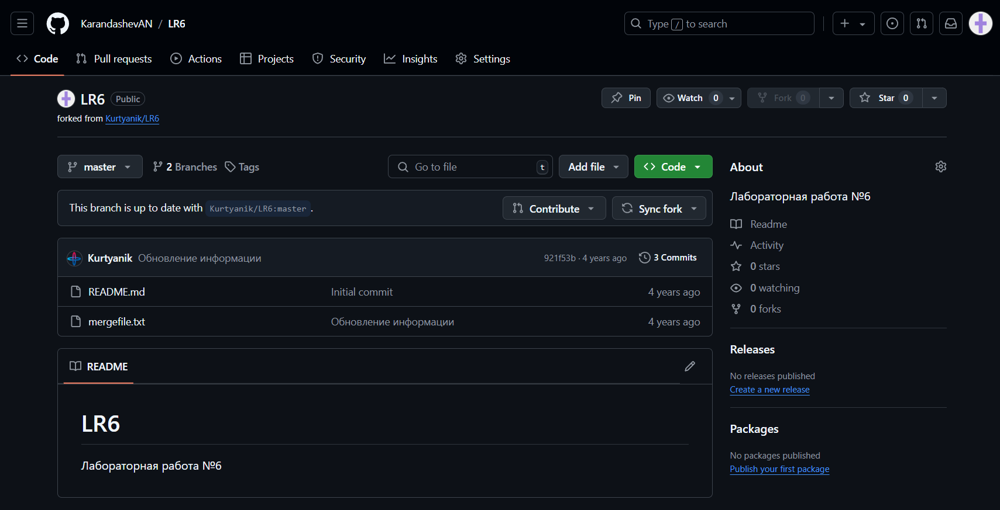

3. Установить Git (https://git-scm.com/).

4. После установки настроить клиент git, введя имя пользователя (Группа 
Фамилия И.О.) и email.

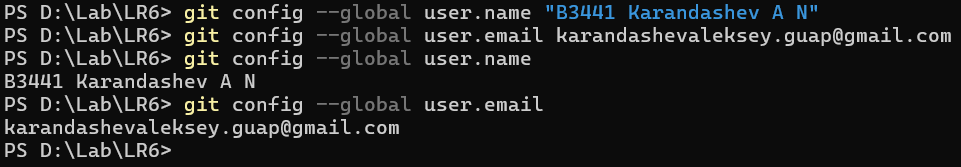

5. Клонировать свой личный удалённый репозиторий на компьютер.

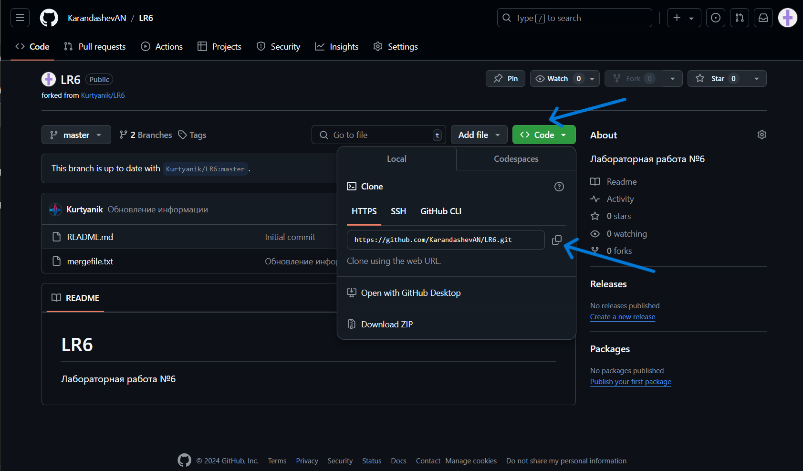

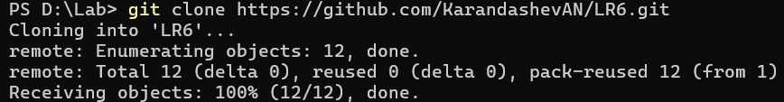

6. Добавить файл через интерфейс GitHub. Подтянуть изменения в 
локальный репозиторий.

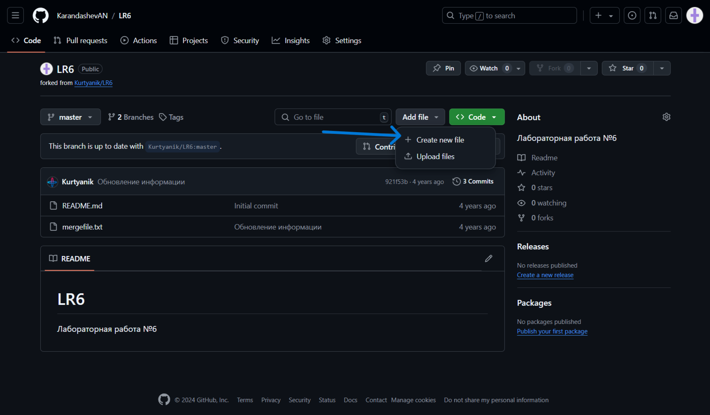

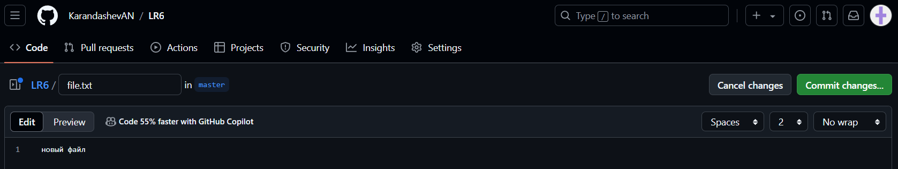

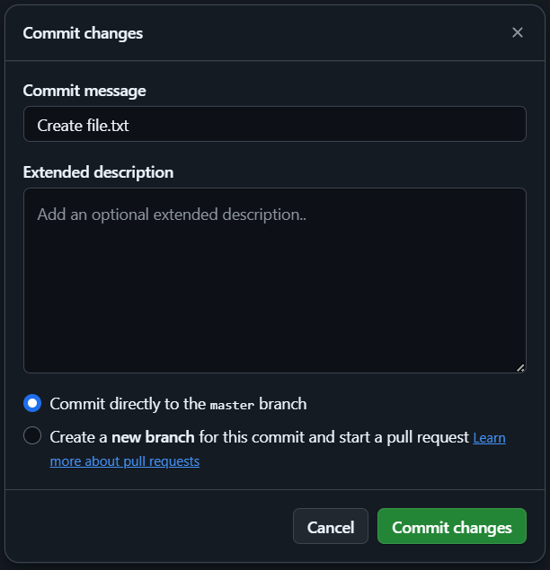

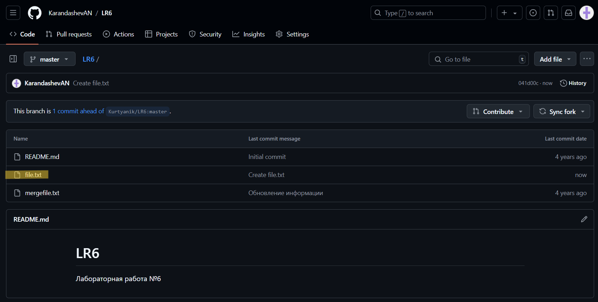

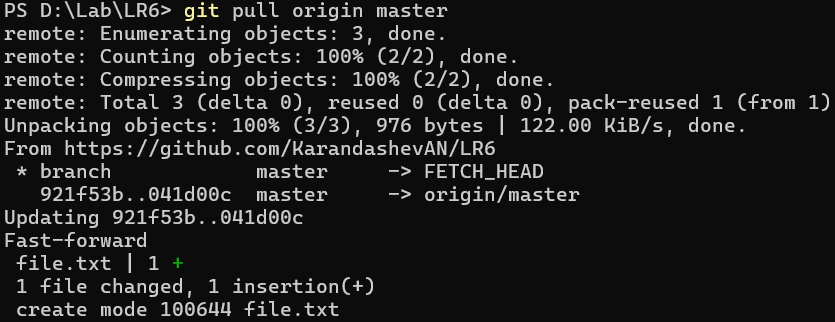

7. Получить историю операций для каждой из веток.

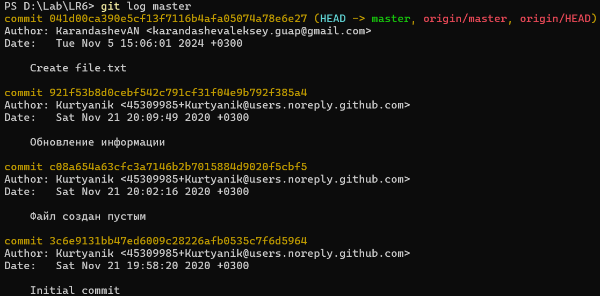

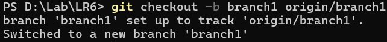

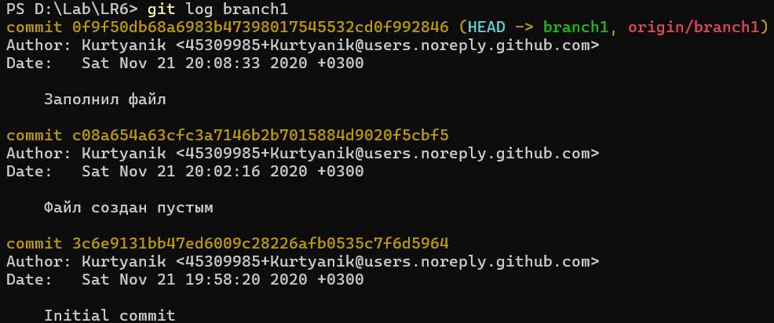

8. Просмотреть последние изменения.

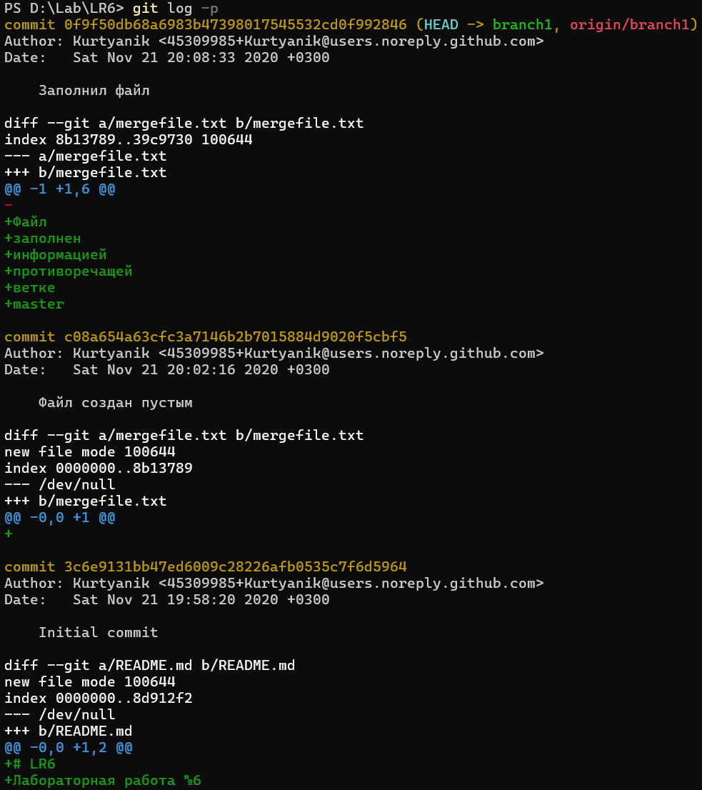

9. Выполнить слияние в ветку master, разрешив конфликт (можно 
использовать специальные редакторы или графический интерфейс git).

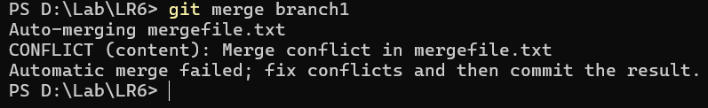

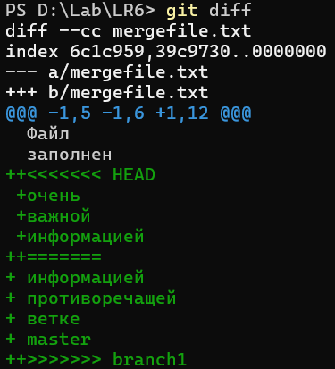

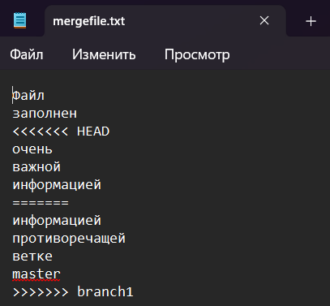

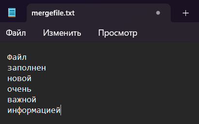

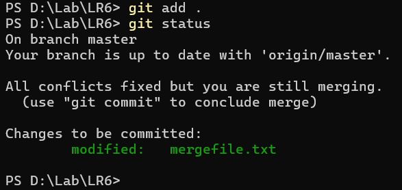

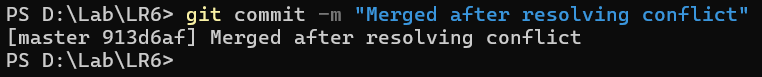

10. Удалить побочную ветку после успешного слияния.

Удаление в локальном репозитории.

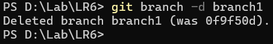

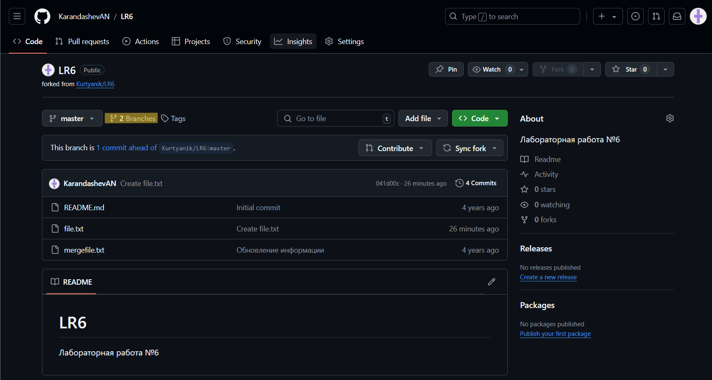

Удаление в удаленном репозитории.

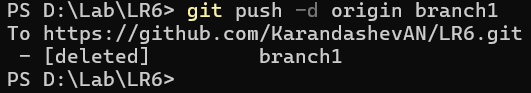

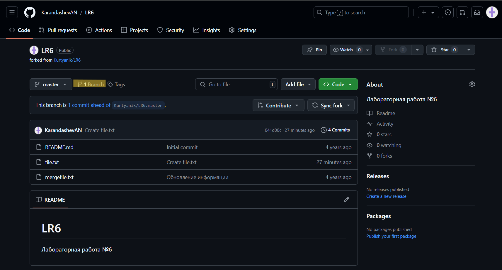

11. Сделать изменения и зафиксировать их, оставляя комментарии, 
несколько раз.

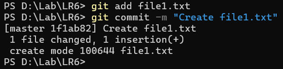

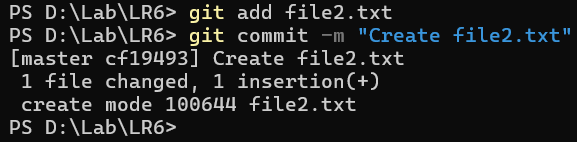

12. Сделать откат коммита.

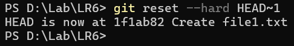

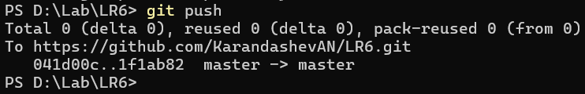

13. Создать ветку для отчёта.

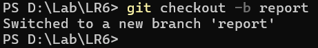

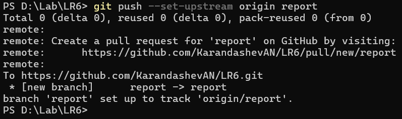
